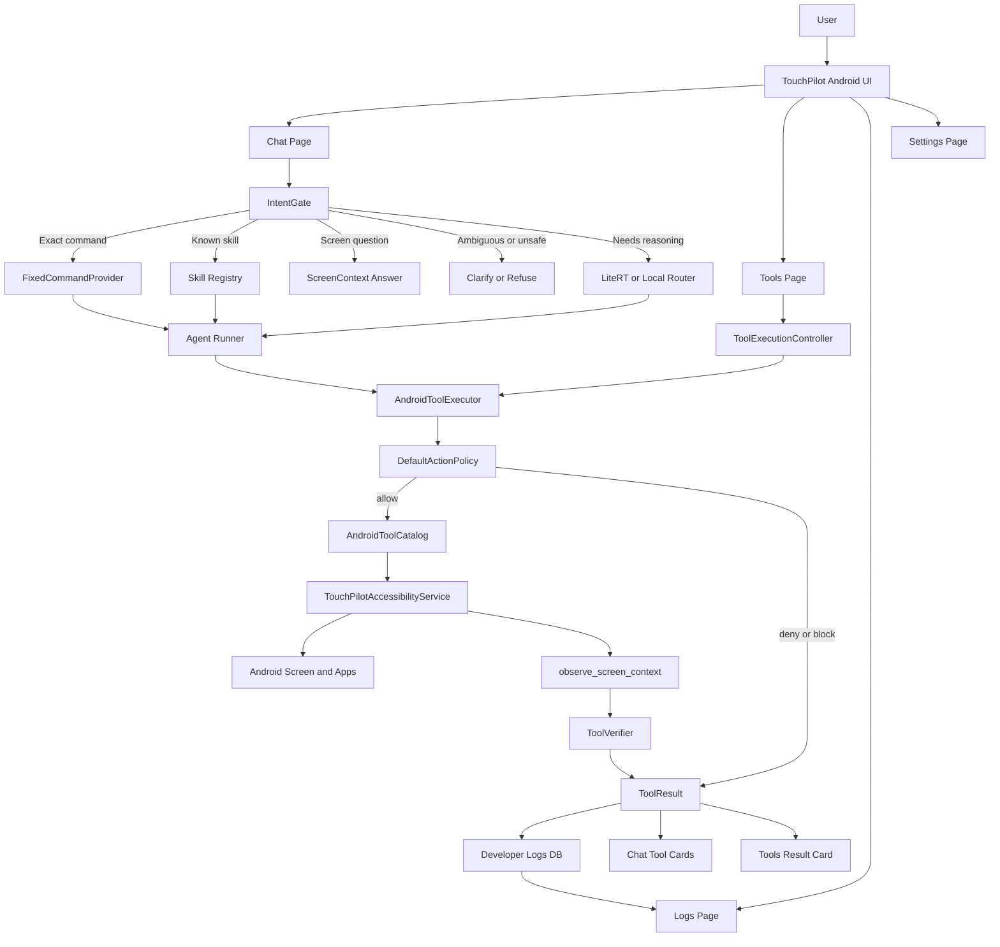
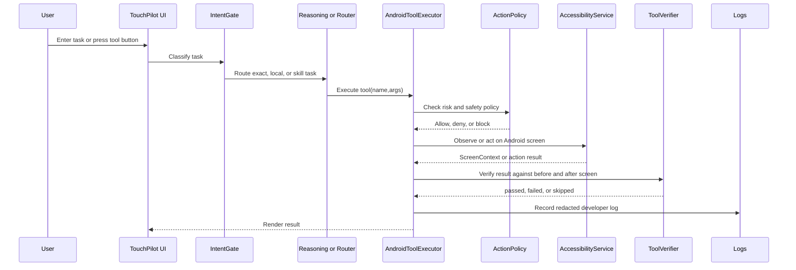
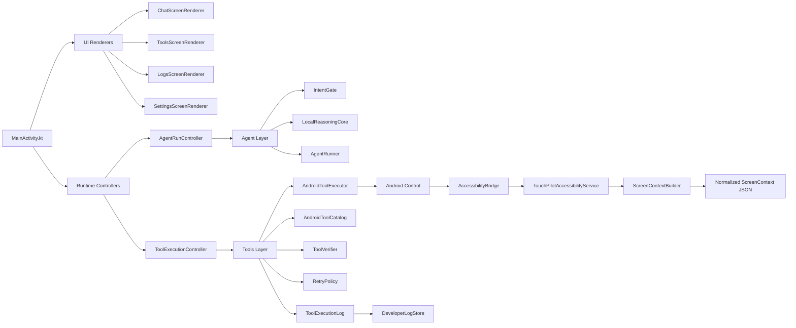

# Architecture

TouchPilot is organized around a small agent runtime and a typed Android tool
layer. The product direction is 100% local: command production, reasoning,
skills, memory, logs, policy, and Android control should run on device for core
product behavior.

```text
User
  -> Chat UI
  -> Agent Runtime
  -> Hybrid Local Router
      -> Intent Gate
      -> Deterministic Router
      -> Local LiteRT Models
      -> Future Local LLM/VLM Runtime
  -> Tool Router + Policy
  -> Android Tool Layer
  -> Accessibility / Intents / Storage / Notifications

MCP Client
  -> HTTP JSON-RPC MCP Server
  -> External tools
```

## Current Runtime Workflow



## Tool Execution Sequence



## Current Code Map



## Core Modules

- `app`: Android UI, navigation, settings, permissions.
- `agent`: session loop, intent gate, local reasoning core, context building,
  conversational gating, and retries.
- `tools`: tool specifications, routing, validation, execution results.
- `androidcontrol`: AccessibilityService integration and action execution.
- `memory`: local sessions, tool logs, skills, and audit storage.
- `security`: approvals, policy checks, risk classification, secret storage.
- `mcp`: optional local extension-tool boundary.
- `localinference`: LiteRT command-router runtime and local-model fallback.

## Local-First Execution Loop

1. User sends a request.
2. Agent runtime builds context from session, skills, and current policy.
3. The intent gate chooses deterministic routing, skill execution, local model
   reasoning, or clarification.
4. The selected local command path returns a message or a structured tool call.
5. Tool router validates the requested tool and arguments.
6. Active skill allowlist approves or denies the requested tool.
7. Security policy approves, denies, or asks the user.
8. Android tool layer executes the action.
9. Result is logged and fed back to the agent.

## Runtime Boundaries

TouchPilot separates local command production from tool execution:

- Deterministic local router: the current default. It maps simple commands such
  as observe, back, home, scroll, open app, and tap text to structured tool
  calls without network access.
- Intent gate: routes exact commands, known skills, unsafe requests, and
  model-needed requests before invoking a model.
- Small local routing models: LiteRT paths for command routing, target ranking,
  screen summarization, and future compact local model roles. These models emit
  the same structured JSON command format.
- Local LLM runtime: future on-device reasoning path for richer multi-step
  tasks. It should use the same tool validation, approval, skill allowlist, and
  logging pipeline as the router.

All command producers share the same policy boundary. A local model can suggest
a tool call, but only the tool router, skill allowlist, and safety policy decide
whether it can execute.

## Local Extension Boundary

TouchPilot treats local extension tools as a separate boundary from the built-in
Android tool catalog:

- local extensions are registered on device and stored locally,
- each extension has its own external capability grant in Settings > MCP,
- extension calls go through the `mcp` package and the external capability
  policy path, not the Android `ToolSource` / `PolicyEngine` path,
- Android control permissions never authorize extension tools by themselves.

This boundary is intentionally narrower than the external MCP protocol surface.
The app can talk to an external MCP server and can also host or load a local
extension endpoint, but those are reviewed and granted separately.
