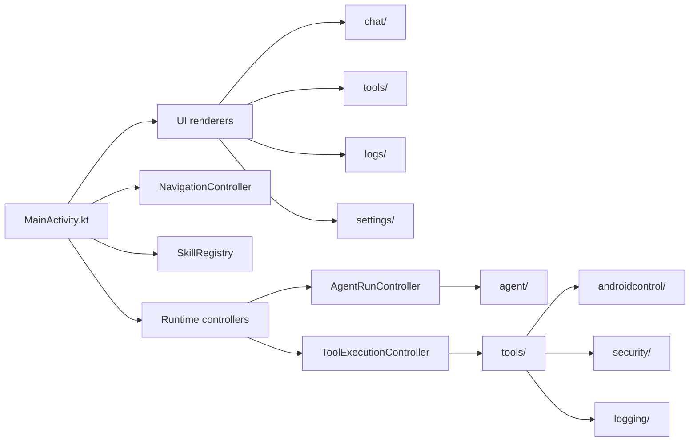

# Code Structure

TouchPilot is currently a single Android application module. The production
source, packaged assets, and tests live under `app/`.

## Root Layout

```text
app/        Android app source, runtime code, assets, and tests
docs/       Architecture, roadmap, validation, and tool documentation
examples/   MCP/provider examples and integration notes
.github/    CI, issue templates, labels, and PR automation
gradle/     Gradle wrapper files
```

The project intentionally does not define separate Gradle modules for agent,
tools, security, memory, or Android control yet. Those boundaries are expressed
as packages inside the app module until the architecture is stable enough to
split into real modules.

## App Packages

```text
app/src/main/java/dev/touchpilot/app/
  agent/            Agent loop, command parsing, reasoning, run records, and UI models
  androidcontrol/   AccessibilityService bridge, screen access, and Android actions
  localinference/   LiteRT command-router runtime and local model contracts
  logging/          Developer log model and SQLite-backed log storage
  mcp/              HTTP JSON-RPC MCP client models and transport
  memory/           Packaged skill loading and skill metadata
  screen/           ScreenContext models, builders, summaries, and OCR fallback helpers
  security/         Action policy, approvals, redaction, and risk handling
  tools/            Tool catalog, validation, execution, retry, verification, and targets
```

`MainActivity.kt` currently owns app orchestration and wires together navigation,
runtime controllers, skill selection, logs, and screen renderers. Most visible
screen construction now lives under `app/src/main/java/dev/touchpilot/app/ui/`,
including chat, tools, logs, settings, shell, and shared component helpers.
Future refactoring should continue shrinking `MainActivity.kt` by moving
orchestration state into focused controllers without changing runtime behavior.

## Runtime Shape



## Assets

Packaged skills are canonical under:

```text
app/src/main/assets/skills/
```

Bundled skill files should follow the Skills v2 contract documented in
[Skills](SKILLS.md). Keep skill metadata in packaged assets so the Android app,
tests, and local agent runtime all read the same source.

Packaged local model assets are canonical under:

```text
app/src/main/assets/models/
```

Do not add duplicate root-level skill or model folders unless there is a build
or sync process that explains how they stay consistent with packaged assets.

## Future Module Split

A future multi-module layout may introduce modules such as `:core-agent`,
`:core-tools`, `:core-security`, `:android-control`, and `:local-inference`.
That should happen only after the package boundaries are stable and the app no
longer depends on a large activity-level orchestration surface.
